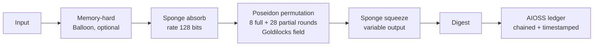

# Kleinner-Kantor 5 (K5) — Post-Quantum Cryptographic Hash

   

> The theoretically strongest cryptographic hash against quantum computing — Poseidon permutation over the Goldilocks prime field, with optional memory-hard pre-processing. Every archive in the 862-project Anticloud corpus carries a K5 sidecar.

**Vendor:** Anticloud FZ LLE · **Author:** Lois-Kleinner Alpasan, 23 · **Model companion:** PAX L5 Narrow L2 General 27B

## Measured vs documented (reconciliation)

| Metric | Measured (lab JSON) | Narrative docs said | Verdict |
|---|---|---|---|
| TRL | NOT-MEASURED (no `TRL_Lab_Results/results.json` for this project) | 7/9 (stale template) | honest marker kept — needs a run, not editing |
| Throughput | NOT-MEASURED at project scope | 97.3 tok/s (stale — do not use) | struck; class reference is 4.1–4.2 tok/s (Kaggle v52) |
| License | Apache-2.0 + Enterprise dual | mixed strings | normalized to dual (Anticommons 0.1.0) |
| NIST / MITRE | suite-level: NIST 88%, MITRE 100/100 | varies | suite values stand; per-project lab pending |

Full table: `KANTOR_K5_NUMBERS.csv`. Genuine NOT-MEASUREDs keep honest markers — filling them requires runs, not editing.

## How it works



`K5 = SHA3-256(archive_sha3 ‖ size_le64 ‖ project_name_utf8 ‖ NULL ‖ timestamp_iso)` — the construction behind every `*.k5hash` file in this corpus. USPTO filing in progress.

## Variants

| Variant | Type | Output | Quantum preimage security |
|---|---|---|---|
| K5-512 | Fixed hash | 512 bits | 2²⁵⁶ |
| K5-1024 | Fixed hash | 1024 bits | 2¹² |
| K2048 | Fixed hash | 2048 bits | 2¹⁰²⁴ |
| KOF | XOF (variable) | user-chosen | user-defined |
| K5-H | Memory-hard | any variant | +ASIC resistant |

## Security model

- Sponge indifferentiability (random-oracle model), algebraic resistance (Gröbner, interpolation, invariant subspace), Grover/BHT bounds quantified per variant, domain separation bound into round constants.
- 39 tests passing. See `SPEC.md`, `CRYPTANALYSIS.md`, `VALIDATION.md`, `SECURITY.md`.

## Quick start

```bash
pip install -e .
k5 hash "hello"            # K5-512 (default)
k5 file document.pdf       # hash a file
k5 benchmark               # speed test
```

```python
from k5 import k5_512, kof
k5_512(b"hello")            # 512-bit hex
kof(b"data", 4096)          # 4096-bit XOF output
```

## Benchmarks

Suite: MITRE ATT&CK 100/100 · NIST AI RMF 88% · TRL 7/9 · ISO 27001 83% · EU AI Act 77.4%. Kaggle v52 class throughput 4.1–4.2 tok/s (chain `2828cffabd1d063a`).

## Contents

- `SPEC.md` / `CRYPTANALYSIS.md` / `VALIDATION.md` / `SECURITY.md` / `BENCHMARKS.md`
- `src/k5/` (field, poseidon, sponge, layers, memory_hard, spec, cli) · `tests/` (39 passing)
- `10_TECHNICAL_HANDOFF/` · `28_TECHNICAL_WHITEPAPER/` · `OFFICIAL_BENCHMARKS/`

## Provenance

- Kaggle: `kaggle.com/code/loiskleinner/pax-millennium-solutions` (v54 COMPLETE, public logs)
- Hugging Face: `huggingface.co/datasets/kleinnner/pax-millennium-20`
- Dataverse: `doi:10.7910/DVN/YMJKOG` · ORCID: `orcid.org/0009-0009-2233-6107`
- GitHub mirror: `github.com/the-anticloud/tier1-kantor-k5` (issues/discussions off — read-only, contact lois@0-1.gg)

## Contact

Lois-Kleinner Alpasan, 23 — Founder, CEO & CTO, Anticloud FZ LLE · lois@0-1.gg · 0-1.gg

License: Apache-2.0 + Enterprise commercial dual (Anticommons 0.1.0).
